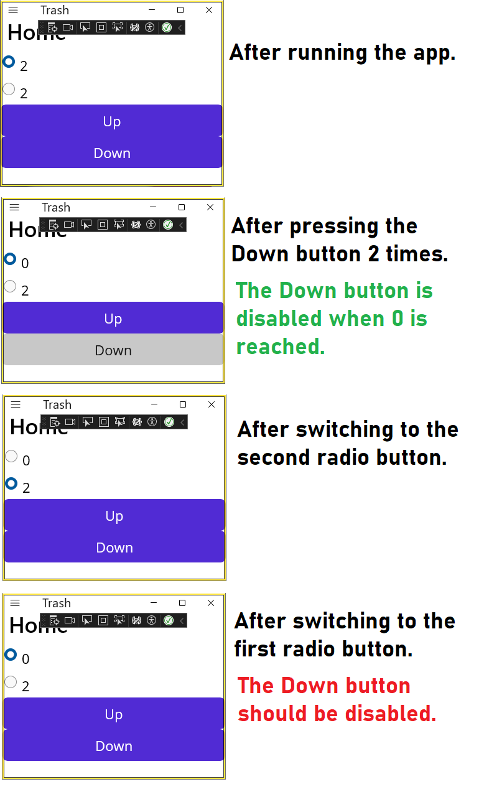

### Background
- A custom control `Changer` has one bindable property `Text` and 2 buttons:
  - `Up` (incrementing the `Text`) and 
  - `Down` (decrementing `Text` as long as `Text` is positive). The `Down` button is disabled when `Text` is 0.
- `MainPage` is bound to `MainPageViewModel` and it has 2 radio buttons:
  - `RadioValueA` is bound to `ValueA` of the `MainPageViewModel`.
  - `RadioValueB` is bound to `ValueB` of the `MainPageViewModel`.

### Issues
Consider the following screenshots.
The `Down` button should be disabled when the first radio button is selected.



### Workaround
Manually assign `Text` after programmatically set-binding it.
```cs
ChangerInstance.SetBinding(Changer.TextProperty, nameof(MainPageViewModel.ValueA));

// Why should I call the following?
ChangerInstance.Text = _model.ValueA.ToString();
```

### Question
Why should I manually assign `Text` right after set-binding it?
Should it be done automatically by the framework? 
Is it a bug or a feature by design? 
